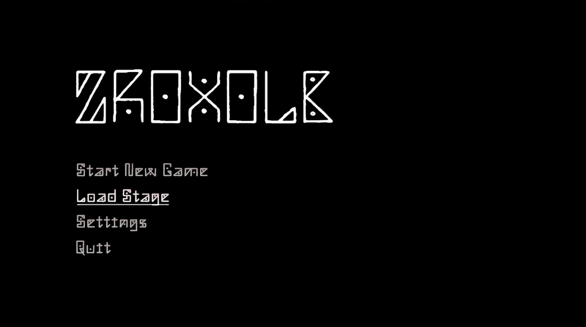
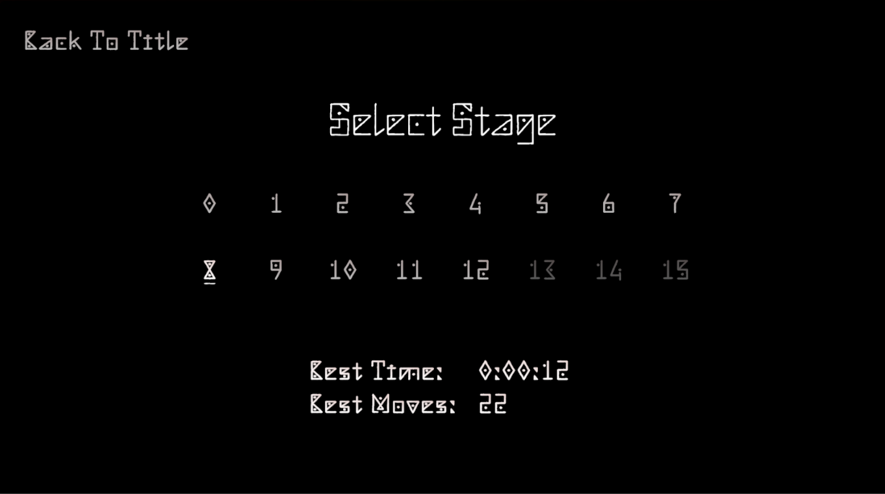
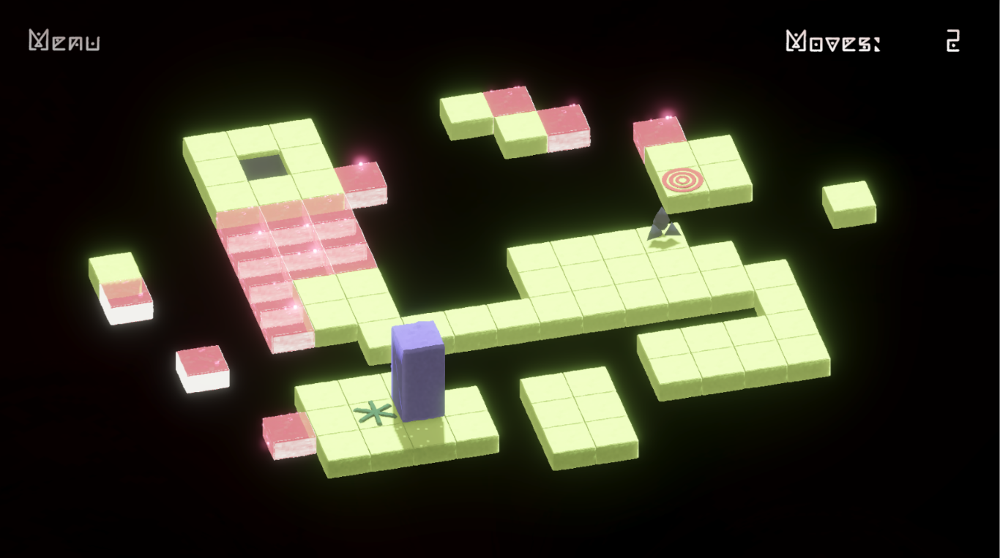
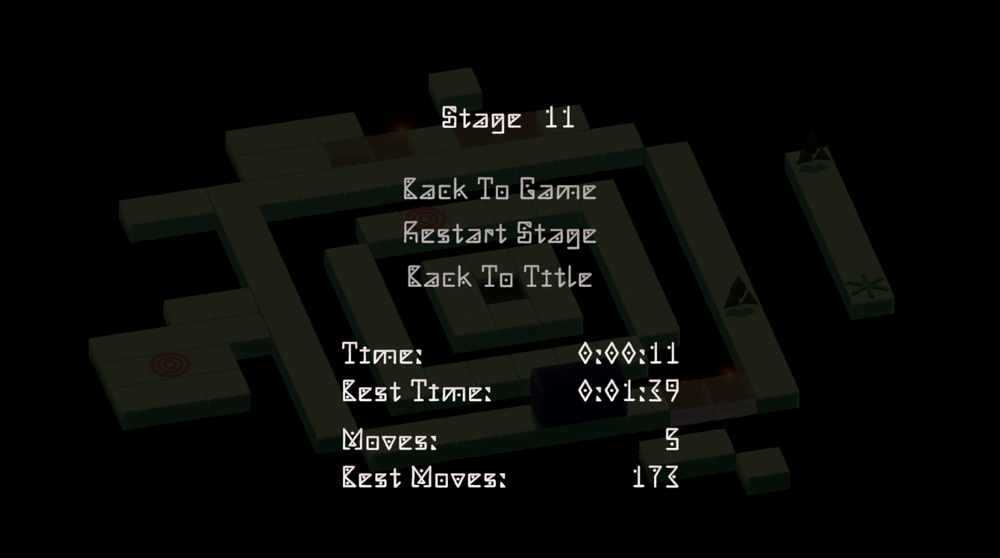
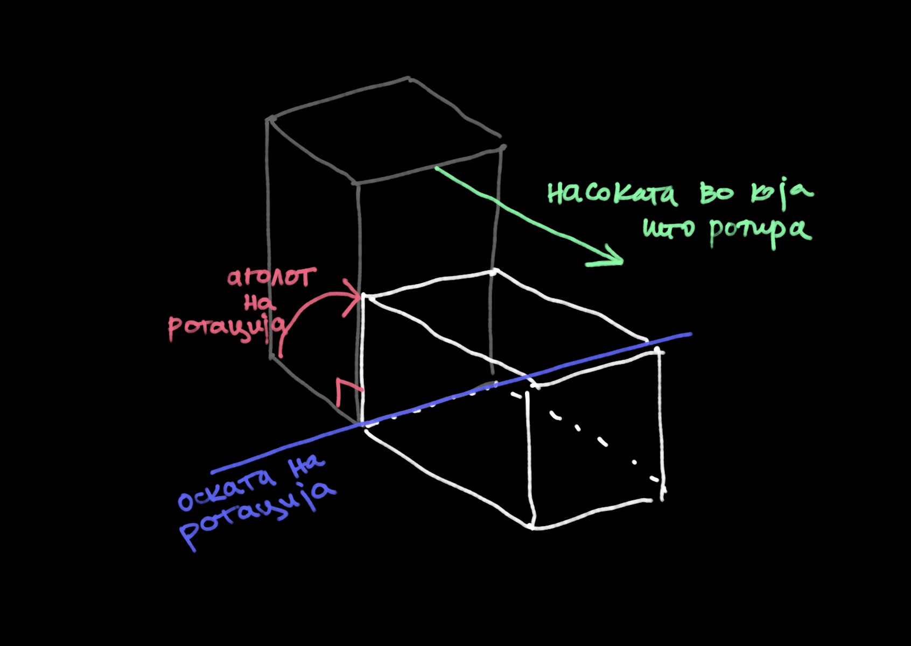
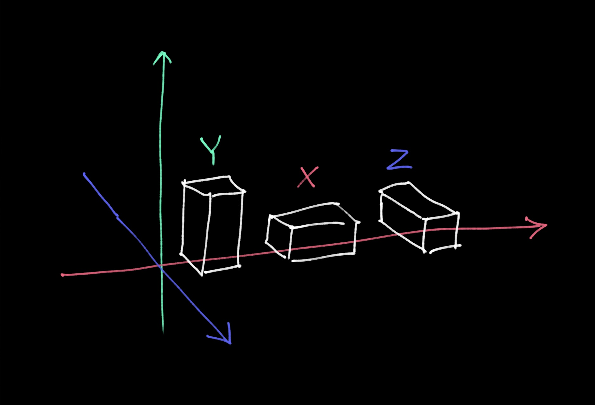
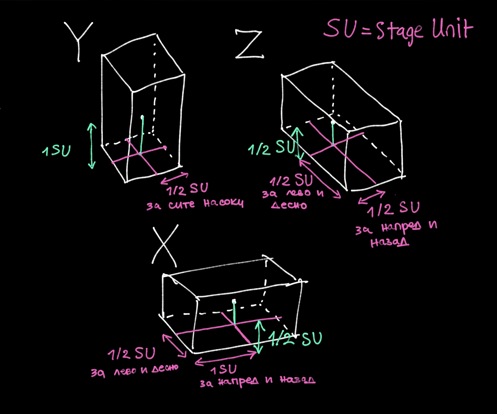

# Zroxolb

Zroxolb e рекреација на класичната играта Bloxorz, што претставува логичка игра во која управуваш со блок кој треба да падне низ означената дупка на платформата. Блокот се движи со превртување по површината и нивоата содржат различни пречки, прекинувачи и механизми што треба да се искористат за да се стигне до целта, без притоа блокот да падне надвор од платформата. (Видео од оригиналот: https://www.youtube.com/watch?v=ES99QA8t7ns)

### Опис и насоки за играта

На почетниот екран може да се започне со првиот левел, или да се селектира конкретен преку Load Stage. 



Има 16 нивоа и секое ниво се отклучува по успешно завршување на претходното. Состојбата на отклучени и неотклучени стази може да се види на Select Stage екранот. Дополнително се прикажуваат информации за најдобро време и потези при hover.



Блокот се движи со помош на WASD копчињата. Целта е да падне во означената дупка.
Играчот автоматски го **рестартира** нивото доколку падне надвор од платформата.



Елементите со кои блокот може да се сретне на платформата се:
- **обични плочки** (можат да ја издржат целосната тежина на блокот - и во случај да е вертикално застанат)
- **целната дупка** (онаа врз која играчот мора да застане вертикално за да падне и го заврши нивото)
- **слаби плочки** (можат да ја издржат само половина од тежината на блокот, односно доколку блокот се најде исправен над нив, тие се кршат и играчот паѓа)
- **'мек' прекинувач** (прекинувач кој се активира кога блокот ќе го притисне, со што предизвикува промена на состојбата на некои плочки на левелот)
- '**тврд' прекинувач** (иста функција како мекиот прекинувач, само што може да биде активиран само доколку блокот застане исправен со целата тежина врз него)
- **ѕвезда** (дополнителен механизам којшто го нема во оригиналната игра; при нејзино обезбедување играчот добива моќ - неколку чекори може да лебди и над празните површини каде не е поддржан од платформата, меѓутоа во тоа време ја губи можноста да ги активира механизмите за кои е потребна неговата целосна тежина, како и можноста да падне низ крајната дупка)

Во тек на играњето е прикажан бројач на моментални потези, а доколку се отвори менито повторно се гледаат Best Time и Best Moves:



По завршување на финалниот левел, се прикажуваат севкупните статистики од сите 16 левели: **Total Moves** и **Total Time**.

## Решение на проблемот 
Играта Zroxolb е изработена во Unity користејќи го темплејтот Universal 3D, и 3D моделите се изработени во Blender. За проектот е применет Feature Branch Workflow.
#### Реупотребливи елементи (Prefabs)
За сите елементи потребни за креирање на едно ниво се креирани **prefabs** - шаблон на GameObject кој ги зачувува неговите компоненти, својства и поставки. Сите нивоа се исто претворени во prefabs, за нивно полесно менаџирање.
#### Управување со играчот
За управување со блокот се користи Input System-от на Unity, преку кој се дефинирани Input Actions: **RollForward**, **RollBack**, **RollLeft** и **RollRight**. Секоја од акциите е поврзана со соодветно копче (WASD) и при негово притискање испраќа сигнал до скриптата на играчот **Player.cs**, која што подоцна презема соодветна акција.

Player скриптата е прикачена за објектот **Player** кој претставува квадар со димензии 1:2:1. Како деца на објектот се поставени и дополнителни две коцки соодветно на двете половини од квадарот, кои се потребни при детектирање на состојбата на блокот и неговите интеракции со платформата (или lack-thereof) и механизмите. Со цел да се овозможи таква детекција, сите објекти имаат **Box Collider**.

Блокот дополнително има **Rigidbody**, кој е потребен само во моментите кога паѓа. Во остатокот од играта не се движи со физика, туку според прецизно пресметани ротации и поместувања околу соодветниот раб, бидејќи е многу битно се да остане порамнето.

Во Player.cs се чуваат следните основни податоци, покрај други:
- `RollDuration` (колку време трае ротацијата еден потег)
- `rollingAllowed` (дали е дозволено движење, пр. блокот не е дозволено да се движи откога веќе ќе падне, или доколку претходниот потег е во тек)
- `playerOrientation` (дали играчот е порамнет по X, Y или Z оската, битно за одредување точка на ротација при потег, и многу други проверки)
- `cube1` и `cube2`  (двете подкоцки од блокот)

По секој потег, се прави проверка за состојбата на блокот и се презема соодветна акција. Оваа класа е подетално објаснета понатака.

Доколку настане паѓање на играчот во дупката или надвор од платформата, `Player.cs` го информира `StageManager.cs` за тоа.

#### Менаџирање на стазите
`StageManager` е, како што вика името, менаџер на левелите. Значи, он ги има сите нивоа во листа, ја има информацијата за кој е моменталниот левел и неговиот индекс, и ја зачувува состојбата на отклучени левели.

Најбитните методи на StageManager се `LoadStage()` и `StageClear()`. 

`LoadStage()` прави инстанца од предефинираниот шаблон (prefab) на моменталниот левел, а ја брише инстанцата од претходниот. `StageClear()` го отклучува следниот левел, доколку не бил отклучен, и го започнува истиот.

Притоа, `StageManager` иницира повеќе значајни настани преку кои ги известува останатите скрипти за промени во состојбата на играта. Меѓу најзначајните настани се **LoadNewStage**, **StageLoaded**, **StageCleared**, **LastStageCleared** и **UnlockedStage**, кои имаат особено значење за функционирањето на `ScreenManagerScript` и `GameStats`.
#### Менаџирање на екраните
Имплементирани се неколку екрани (Title screen, Select stage, Interstage, Gameplay, Menu и крајниот екран) кои се менаџирани од `ScreenManager.cs`. Со помош на настаните добиени од `StageManager`, како и повиците иницирани од копчињата на самите екрани, `ScreenManager` го прикажува соодветниот екран. Главната функција на оваа скрипта е `ShowScreen(GameObject screen)`, која се користи за прикажување на избраниот екран и истовремено сокривање на останатите екрани.
#### Менаџирање статистики
`GameStatsManager` ги чува тековните статистики за бројот на чекори (`moves`) и времето (`time`), а реагира на настаните `Rolled`, `StageLoaded` и `StageCleared`.

Бројот на чекори се зголемува при секое активирање на `Rolled`, додека времето се ажурира континуирано во `Update()`. При `StageLoaded` се ресетираат тековните статистики, а при `StageCleared` се ажурираат најдобрите постигнувања за конкретниот левел - минималниот број на чекори и најкраткото време.

Покрај главните скрипти, имплементирани се и неколку помошни класи:
- **WeakTile** - прикачена за секоја слаба плоча; има метода за кршење на плочата
- **Switch** - прикачена на секој прекинувач; ја има моменталната состојба на прекинувачот (on/off), ја чува информацијата за кои се плочките на кои им ја менува состојбата и ја има методата Toggle()
- **Star** - чува информација за тоа колку "лебдечки" чекори нуди ѕвездата
и др.

## Опис на избрана класа
Ќе објаснам некои од главните методи на класата Player, која е прикачена за блокот. Таа го овозможува неговото движење и неговата интеракција со останатите елементи од левелот.

####  RollToDirection(Vector3 rollDirection)
Методата `RollToDirection(Vector3 rollDirection)` го извршува превртувањето на играчот според дадена насока.

На почетокот на самата функција се забранува вртењето на играчот `rollingAllowed = false`, што спречува на сред вртење да се започне друго, со тоа што пред повикот на оваа функција се проверува дали истото е дозволено.

Знаеме дека играчот секогаш ќе се ротира со агол од 90 степени, меѓутоа треба да се одреди точниот раб (односно точка од работ) околу којa треба да се ротира, како и оската на ротација.



Оската на ротација ќе е насоката на движење изротирана за 90 степени во насока на стрелките на часовникот, што ја одредувам со `GetAxisOfRotation(Vector3 rollDirection)`.
```
private Vector3 GetAxisOfRotation(Vector3 rollDirection)
{
    if (rollDirection == Vector3.back)
        return Vector3.left;
    if (rollDirection == Vector3.forward)
        return Vector3.right;
    if (rollDirection == Vector3.left)
        return Vector3.forward;
    if (rollDirection == Vector3.right)
        return Vector3.back;
    else return Vector3.zero;
}
```

`пivotOfRotation` зависи од насоката на движење, димензиите и моменталната ориентација на блокот. За следење на ориентацијата е креиран `enum Orientation {X, Y, Z}` и методата `NextOrientation(Vector3 rollDirection)`, која ја ажурира ориентацијата по секој потег и се користи во повеќе други методи.



За димензиите на коцката користам променлива `StageUnit`, која се одредува на почетокот и одговара на ширината на плочките и на должината и ширината на играчот, додека неговата висина е `2 * StageUnit`.

Бидејќи секогаш ја имаме моменталната позиција на играчот, од неа започнува пресметката на pivot-то за ротација. При `Y` ориентација, пресметката е наједноставна: од центарот на играчот се поместува за еден `StageUnit` надолу и за `1/2 StageUnit` во насоката на движење. Кај останатите ориентации пресметката е посложена, па методите ги осмислив со помош на цртежи како овој подолу.



```
private Vector3 GetPivotOfRotation(Vector3 rollDirection)
{
    Vector3 pivotOfRotation = transform.position;
    if (playerOrientation == Orientation.Y)
    {
        pivotOfRotation += Vector3.down * StageUnit + rollDirection * StageUnit / 2;
    }
    else if(playerOrientation == Orientation.X)
    {
        pivotOfRotation += Vector3.down * StageUnit / 2;
        if(rollDirection==Vector3.forward || rollDirection == Vector3.back)
        {
            pivotOfRotation += rollDirection * StageUnit / 2;
        }
        else
        {
            pivotOfRotation += rollDirection * StageUnit;
        }
    }
    else
    {
        pivotOfRotation += Vector3.down * StageUnit / 2;
        if (rollDirection == Vector3.left || rollDirection == Vector3.right)
        {
            pivotOfRotation += rollDirection * StageUnit / 2;
        }
        else
        {
            pivotOfRotation += rollDirection * StageUnit;
        }
    }
    return pivotOfRotation;
}
```

За постепено извршување на ротацијата се користи `while` циклус кој го следи изминатото време. Во секоја итерација се пресметува аголот за тековниот кадар според изминатото време, по што играчот се ротира околу претходно одредената pivot-точка. Со `yield return null` корутината се паузира до следниот кадар, со што ротацијата се извршува постепено во текот на `RollDuration`.
```
while (elapsedTime < RollDuration)
{
    float previousElapsedTime = elapsedTime;
    elapsedTime = Mathf.Min(elapsedTime + Time.deltaTime, RollDuration);

    float deltaAngle = angle *
        ((elapsedTime - previousElapsedTime) / RollDuration);

    transform.RotateAround(pivotOfRotation, axisOfRotation, deltaAngle);

    yield return null;
}
```

По поместувањето се врши корекција на позицијата и ротацијата на играчот за да се отстранат малите отстапувања што се акумулираат со текот на времето. На пример, позиција `4.899` се коригира на `5`, а `4.478` на `4.5`; аналогно, агол од `89.70°` се коригира на `90°`. За оваа намена е креирана следната функција:
```
private float RoundToUnit(float value, float unit)
{
    return (float)Math.Round(value / unit) * unit;
}
```
На овој начин, секоја вредност се заокружува на најблиската „единица“ - 90° кај аглите и 0.5 кај координатите.
```
private void Correction()
{
    float x = RoundToUnit(transform.position.x, StageUnit / 2);
    float y = RoundToUnit(transform.position.y, StageUnit / 2);
    float z = RoundToUnit(transform.position.z, StageUnit / 2);
    transform.position = new Vector3(x, y, z);

    x = RoundToUnit(transform.eulerAngles.x, 90);
    y = RoundToUnit(transform.eulerAngles.y, 90);
    z = RoundToUnit(transform.eulerAngles.z, 90);
    transform.eulerAngles = new Vector3(x, y, z);
}
```

По успешно превртување и корекција се активира `Rolled`, со кој се известуваат засегнатите класи за извршениот потег, како `GameStatsManager`, кој го зголемува `Moves` бројачот.
Конечно, се проверува состојбата на играчот во однос на платформата со `CheckState()`, и според тоа се поставува вредноста на `rollingAllowed`.

`CheckState()` проверува што се наоѓа под двете коцки кои го составуваат играчот. Со `RaycastHit` од центарот на секоја коцка надолу се детектираат објектите, а нивните информации се зачувуваат во објект од класата `StageUnitState`. Членовите на класата се следни:
```
public GameObject normalTile;
public GameObject weakTile;
public GameObject switchX;
public GameObject switchO;
public GameObject holeTile;
public GameObject toggleTile;
public GameObject star;
```
Откако ќе ги добиеме податоците за двете коцки, тие се разгледуваат заедно и по соодветен редослед за да се одреди што следи.

Најпрво се проверува состојбата со ѕвездата, односно дали `voidRolling == true`. Ако да, `voidRollsLeft` се намалува за еден и, доколку се потрошат, ѕвездата се отпушта и играчот се враќа во нормална состојба. Потоа се проверува дали некоја од двете коцки наишла на нова ѕвезда, при што се ажурираат соодветните параметри.

Следат проверките на настаните што можат да се случат само доколку играчот е во Y ориентација.
- Дали е над целната дупка? - доколку се најде над дупка, започнува паѓање, и на методата RollToDirection се враќа false, со што е оневозможено понатамошно вртење, се дур не се ресетира левелот
- Дали е над слаба плочка? - ако да, се крши плочката, играчот паѓа, и се враќа false
- Дали е над 'тврд' прекинувач? - ако да, се активира прекинувачот, и се продолжува кон следните проверки

Следните проверки се случуваат безразлика на ориентацијата:
- Дали едната коцка се наоѓа над 'мек' прекинувач? - ако да, истиот се активира
- Дали другата коцка се наоѓа над 'мек' прекинувач? - ако да, и ако нема Y ориентација во којшто случај ќе станува збор за истиот прекинувач од претходната проверка, се активира

И конечно се проверува за двете коцки посебно, дали се supported со следната функција 
```
private bool TileSupportsCube(StageUnitState tcr)
{
    return tcr.normalTile != null || tcr.toggleTile != null || tcr.weakTile != null|| tcr.holeTile != null;
}
```
Доколку барем една не е, а нема `voidRolling` во тек, започнува паѓање на играчот и се враќа false.

Доколку се стигне до последната линија од методата, се `rollingAllowed` ја прима вредноста `true`, со што на играчот му е дозволено да направи следен потег.
